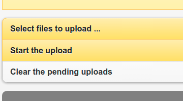

## zhiva.ai local server


### Requirements

Before we start please make sure your server has access to:

- Unix-base shell
- [Docker](https://docs.docker.com/get-docker/)
- [Docker Compose](https://docs.docker.com/compose/install/)
- [OpenSSL](https://www.openssl.org/)
- [python3](https://www.python.org/downloads/) (setup)

### Get the server code

You can either clone this repo
```shell
git clone https://github.com/zhiva-ai/pacs-token-server.git
```
or download it directly from 
[zhiva.ai PACS server](https://github.com/zhiva-ai/pacs-token-server/archive/refs/heads/main.zip).

### Generate local TSL certificate (only once every 365 days)

> Notice
> 
> If you already have the `.crt` and `.key` files do not generate them again. Go straight to [Build the server section](#build-the-server) and run your server with existing certificate.

Before we starty storing data on the server we have to secure the connection between the server and the viewer. We're going to use [Transport Layer Security (TSL)](https://en.wikipedia.org/wiki/Transport_Layer_Security). First, we have to generate certificate (`.crt`) and key (`.key`) files. Because we're doing it from the local server we're going to use [OpenSSL](https://www.openssl.org/) (we don't need external party to sign certificate, if you want to use it on the external server you should sign with something like [Let's Encrypt](https://letsencrypt.org/)).

To generate local certifiate please execute following command in the terminal window (make sure `openssl` is installed).

```shell
openssl req -x509 \
    -nodes -days 365 \
    -newkey rsa:2048 \
    -keyout zhiva.key \
    -out zhiva.crt \
    -subj "/C=PL/L=Wroclaw/O=Your Company, Inc./CN=localhost"
```

Change `-subj` to describe your organization:
- `C` - country code (2 letter code)
- `L` - location (city name)
- `O` - organization name
- `CN` - full domain name (use `localhost` for local servers)

Then copy `.crt` file as trusted certificate:

```shell
cat zhiva.crt > trusted.crt
```

### Setup your local server

At this point you should have 2 `.crt` files and 1 `.key` file. Check this by calling

```shell
 ls *.{crt,key}
```

from your main directory. It should return following result `trusted.crt  zhiva.crt  zhiva.key`.

If one of those files is missing go back to [Generate local TSL certificate](#generate-local-tsl-certificate-only-once-every-365-days) section and make sure you have all of them.

### Setup JWTs

#### Generate private and public tokens

```bash
openssl genrsa -out jwt_priv.pem 512
openssl rsa -pubout -in jwt_priv.pem -out jwt_pub.pem
```

#### Generate server settings

Run setup docker image
```bash
docker-compose --file ./setup/docker-compose.yml build zhiva_setup
docker-compose --file ./setup/docker-compose.yml run zhiva_setup
```

You should be prompted for admin password (`Enter the admin password: `). Store that password in your password management software becuase you won't e able to read it directly.

Setup configuration should be stored in `.env` file.

#### Build the server

```shell
docker-compose up
```

After starting the server you should be able to access [localhost/zhiva/app/explorer.html#upload](https://localhost/zhiva/app/explorer.html#upload) where you can upload your files.

> Important!!!
>
> You might be prompted with the message about invalid SSL certificate. This is caused by using OpenSSL to generate certificate for `localhost` and that certificate has no 3rd party that confirms its authenticity. It's fine for local network but remember to use proper certificate if the server is accessible from outside your network.

### Access from within internal network

If you have more than one computer inside your network (or VPN connection), then you can share the server settings with them. To check the server address please run the following command:

Linux or Mac:
```shell
ifconfig
```

Windows
```shell
ipconfig
```

and look for the setting with the `inet` value that starts with `192.168.`. That should by your address in the local network. You should be able to access the upload page from `192.168.x.x:8042/app/explorer.html`. 

#### Access control settings

If you're using a different domain than default `https://*.zhiva.ai`, make sure you modify `ZHIVA_AUTH_ALLOWED_ORIGINS` variable in `.env` file. This variable stores list of allowed origins to use __Auth Service__. If you want to add another one please change the value to whatever origin you're using (use `*` as wildcard). E.g:

- My application works on my custom domain __zhiva.mydomain.com__:
```yaml
ZHIVA_AUTH_ALLOWED_ORIGINS: 'https://zhiva.mydomain.com'
```
- My application works on multiple custom subdomains under my own domain __mydomain.com__:
```yaml
ZHIVA_AUTH_ALLOWED_ORIGINS: 'https://*.mydomain.com'
```
- My application works on multiple custom domains __directapp.com__, __beta.mydomain2.com__, __staging.mydomain2.com__, __prod.mydomain2.com__:
```yaml
# comma separated values
ZHIVA_AUTH_ALLOWED_ORIGINS: 'https://directapp.com,https://*.mydomain2.com'
```

### Upload your DICOMs

Go to [localhost/zhiva/app/explorer.html#upload](https://localhost/zhiva/app/explorer.html#upload) and click on `Select files to upload`.



After selecting all the DICOMs click `Start the upload` to store them on the server.

All DICOMs are stored in [Docker's persistent volume](https://docs.docker.com/storage/volumes/) so even after restarting the server all your files are still accessible.

Now you should be able to access studies which were generated after uploading DICOM files. List of studies is available at [https://localhost/zhiva/app/explorer.html#find-studies](https://localhost/zhiva/app/explorer.html#find-studies).

### FAQs

- _"Why my server doesn't accept very large DICOM files?"_

There is an maximum file size setting inside server config. If you want to change that please go to `./nginx.conf` and modify:
```nginx configuration
client_max_body_size 2000m;
```
